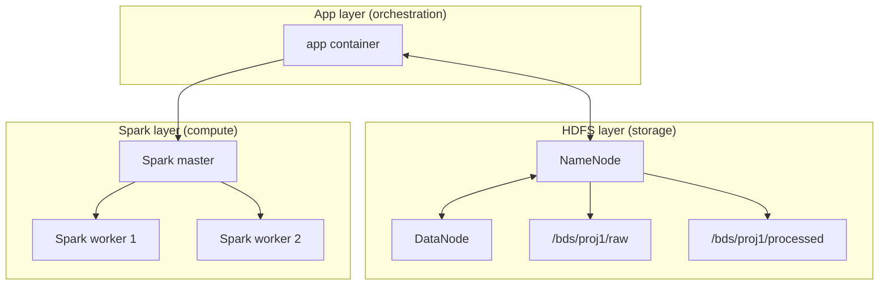

# Architecture (target)

## Layer model

### Infrastructure structure diagram

### 1) HDFS layer

- Services: NameNode + DataNode(s)
- Responsibility: durable storage for raw and processed data
- Canonical paths:
  - `/bds/proj1/raw`
  - `/bds/proj1/processed`

### 2) Spark layer

- Services: Spark master + workers
- Compose services: `spark-master`, `spark-worker-1`, `spark-worker-2`
- Responsibility: distributed execution only
- Reads/writes data via HDFS
- No business logic ownership

### 3) App layer

- Services: project app container(s)
- Compose service: `app`
- Responsibility: pipeline/job orchestration (CLI/API)
- Submits Spark jobs to cluster
- Owns job entrypoints:
  - preprocessing
  - filtering/sorting/count/display
  - grouped statistics
  - benchmark runner (later)

## Preprocessing placement

Preprocessing belongs to the App layer.

Execution model:

1. App triggers preprocess job
2. Spark executes transformations
3. Input from HDFS `/bds/proj1/raw`
4. Output to HDFS `/bds/proj1/processed/*`

## Comparison principle

For performance comparison, both execution modes must use:

- same app code
- same HDFS input data
- same operations

Only execution architecture changes (`local[*]` vs Spark cluster).
