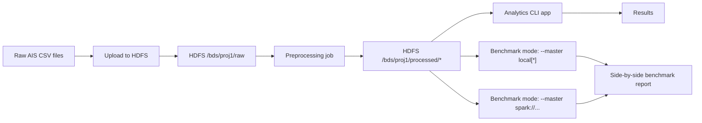

# Project Strategy (Atomic Execution)

## Goal

Deliver the course project in strict, approved phases:

1. Prepare ~1GB subset and place it on HDFS
2. Build Spark analytics app with CLI-driven operations
3. Compare `local[*]` vs Docker Spark cluster on same HDFS source

## Working agreement

- Execute one atomic step at a time.
- Do not continue without explicit approval.
- Keep `README.md` short; details go into `docs/`.
- After each completed/approved phase, create one reproducibility checkpoint script in `automation/phase<N>_<semantic_name>.sh`.
- Create phase checkpoint scripts only after implementation works and phase docs are updated.

## Architecture decision

We are steering toward a 3-layer architecture:

1. HDFS layer (storage/persistence)
2. Spark layer (master/workers compute)
3. App layer (jobs, CLI/API orchestration)

Preprocessing is an App-layer job (submitted to Spark, reading/writing HDFS).

## Execution plan

### Top-level workflow diagram

### HDFS Upload (completed)

HDFS bring-up, upload, verification.

### Preprocessing (completed)

Preprocess and reformat raw CSV into:

- `processed/clean`
- `processed/quarantine`
- `processed/quality_report`

### Layered Infrastructure (completed)

Layered infra alignment:

- HDFS persistence layer finalized
- Spark cluster layer added
- App layer container submission flow finalized

### Analytics CLI (completed)

Analytics app features:

- filtering/sorting/counting/display
- grouped min/max/mean/stddev

### Benchmarking (completed)

Performance comparison:

- benchmark runner with timestamped standalone/cluster runs
- raw and processed input size snapshots per run
- per-iteration run reports and final aggregate summaries
- full benchmark checkpoint script for rebuilding stack and running all benchmark workloads

## Checkpoints

There are 4 actual reproducibility checkpoints. Layered infrastructure was a design milestone, not a separate script checkpoint; it is exercised by the preprocessing, analytics, and benchmark checkpoints.

- HDFS upload: `automation/phase1_hdfs_upload.sh`
- Preprocessing: `automation/phase2_preprocessing.sh`
- Analytics CLI: `automation/phase3_analytics_cli.sh`
- Full benchmarking: `automation/phase4_full_benchmarks.sh`
