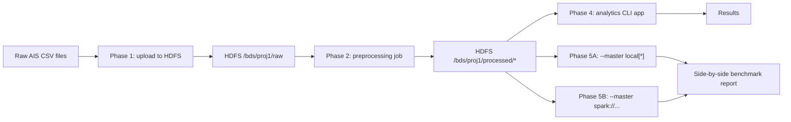

# Project strategy (atomic execution)

## Goal

Deliver the course project in strict, approved phases:

1. Prepare ~1GB subset and place it on HDFS
2. Build Spark analytics app with CLI-driven operations
3. Compare `local[*]` vs Docker Spark cluster on same HDFS source

## Working agreement

- Execute one atomic step at a time.
- Do not continue without explicit approval.
- Keep `README.md` short; details go into `docs/`.
- After each completed/approved phase, create one reproducibility checkpoint script in `automation/phase<N>_<semantic_name>.sh`.
- Create phase checkpoint scripts only after implementation works and phase docs are updated.

## Architecture decision

We are steering toward a 3-layer architecture:

1. HDFS layer (storage/persistence)
2. Spark layer (master/workers compute)
3. App layer (jobs, CLI/API orchestration)

Preprocessing is an App-layer job (submitted to Spark, reading/writing HDFS).

## Phase plan

### Top-level workflow diagram

### Phase 1 (completed)

HDFS bring-up, upload, verification.

### Phase 2 (completed)

Preprocess and reformat raw CSV into:

- `processed/clean`
- `processed/quarantine`
- `processed/quality_report`

### Phase 3 (completed)

Layered infra alignment:

- HDFS persistence layer finalized
- Spark cluster layer added
- App layer container submission flow finalized

### Phase 4 (next)

Analytics app features:

- filtering/sorting/counting/display
- grouped min/max/mean/stddev

### Phase 5 (pending)

Performance comparison:

- same app + same HDFS data
- `local[*]` vs `spark://...`
- repeated runs and side-by-side metrics

## Checkpoints

- Phase 1: `automation/phase1_hdfs_upload.sh`
- Phase 2: `automation/phase2_preprocessing.sh`
